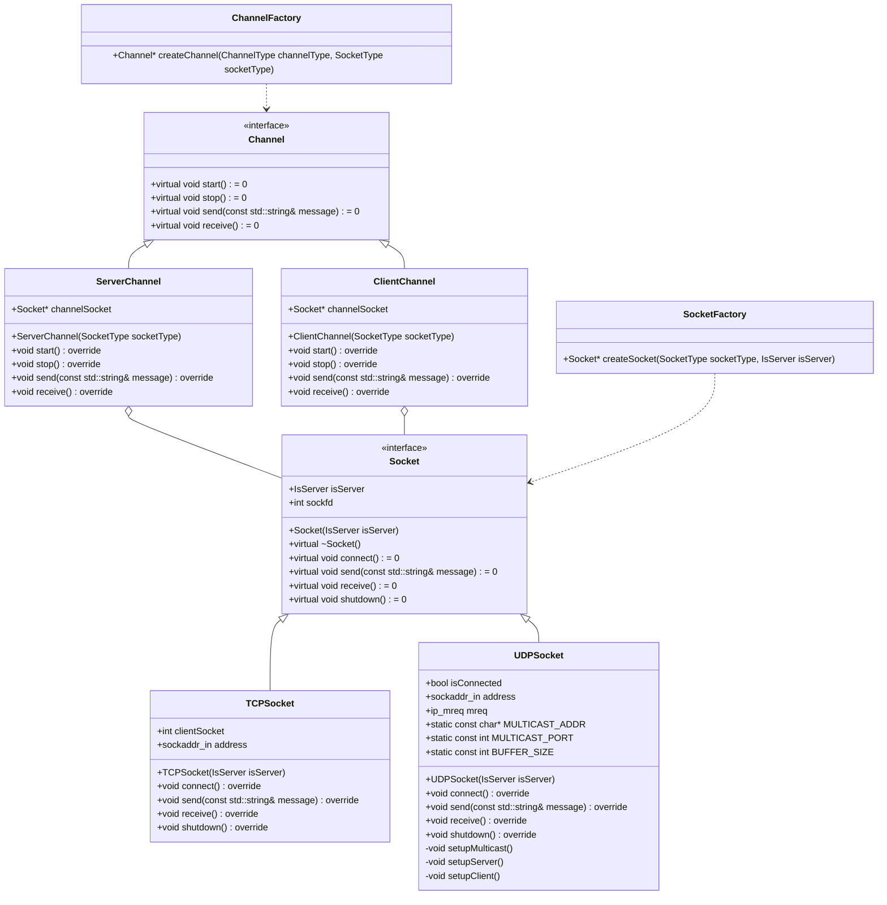

# IoT Device Communication Project

This project is designed to demonstrate network communication using both **TCP** (Transmission Control Protocol) and **UDP** (User Datagram Protocol) while leveraging **Object-Oriented Programming (OOP)** principles and design patterns to build a flexible and scalable structure. The application supports both **unicast** communication over TCP and **multicast** communication over UDP.

## Overview

The project features:
- A **unicast TCP application** for one-to-one communication.
- A **multicast UDP application** for one-to-many communication.
  
These components are built using key OOP concepts and design patterns to create a modular, extendable system.

## Key Features

- **Object-Oriented Design**: The codebase applies OOP principles such as **inheritance**, **polymorphism**, and **encapsulation** to create a maintainable and scalable architecture.
- **TCP and UDP Socket Communication**:
  - **TCP Socket** is used for reliable, unicast communication.
  - **UDP Socket** is used for multicast communication, allowing a single sender to reach multiple receivers in a network.
- **Factory Pattern**: The **Factory Design Pattern** is implemented to handle the creation of `Socket` and `Channel` objects, enhancing flexibility and decoupling object instantiation from their usage.

## Class Structure

The project is organized around key classes to manage TCP and UDP sockets, along with server and client channels.

### Classes

- **Socket (Interface)**: This abstract interface defines the core functions needed for both TCP and UDP communication.
- **TCPSocket** and **UDPSocket**: These classes inherit from `Socket` and implement the specific functionalities for TCP and UDP sockets respectively.
- **Channel (Interface)**: Another abstract interface that defines the methods to start, stop, send, and receive messages.
- **ServerChannel** and **ClientChannel**: These implement `Channel` to handle server and client communication logic, respectively.
- **SocketFactory** and **ChannelFactory**: Factory classes that instantiate `Socket` and `Channel` objects based on the specified type.

## Design Patterns

### Factory Pattern

The **Factory Pattern** is used to manage the creation of `Socket` and `Channel` objects. Instead of directly instantiating specific types of `Socket` or `Channel` objects in the code, the factories (`SocketFactory` and `ChannelFactory`) encapsulate the instantiation logic, allowing the main code to be decoupled from the specific classes it relies on.

#### How It Works

1. **SocketFactory**: Creates instances of either `TCPSocket` or `UDPSocket` based on the `SocketType` and whether it's for a server or client (`IsServer` parameter).
2. **ChannelFactory**: Creates instances of either `ServerChannel` or `ClientChannel` based on the desired channel type and associated socket type.

This approach allows the code to:
- Easily switch between TCP and UDP sockets as needed without modifying the core application logic.
- Extend to new types of sockets or channels in the future with minimal changes to the existing codebase.

## TCP and UDP Communication

### Unicast TCP Application

The TCP component establishes a unicast connection, meaning communication is one-to-one, ideal for applications requiring reliable data transfer between a single client and server. The `TCPSocket` class handles connection setup, sending, and receiving messages.

### Multicast UDP Application

The UDP component supports multicast communication, allowing a single sender to broadcast messages to multiple receivers. This is implemented through the `UDPSocket` class, which handles setting up multicast groups and managing UDP communication for high-speed, low-latency transmission.

## Class Diagram

## The relationships between the classes:

### Inheritance (Generalization):

Socket is an interface that provides an abstract base for TCPSocket and UDPSocket. Both TCPSocket and UDPSocket inherit from Socket, meaning they implement its virtual methods (connect, send, receive, and shutdown).
Channel is an interface that provides an abstract base for ServerChannel and ClientChannel. Both ServerChannel and ClientChannel inherit from Channel, implementing its virtual methods (start, stop, send, and receive).
### Composition:

ServerChannel and ClientChannel both have a composition relationship with Socket, meaning each ServerChannel or ClientChannel contains a Socket instance (indicated by Socket* channelSocket). This relationship implies ownership; when a ServerChannel or ClientChannel is destroyed, its associated Socket may also be destroyed.
### Dependency:

SocketFactory depends on Socket to create instances of Socket objects. It has a static method createSocket that takes a SocketType and IsServer parameter and returns a pointer to a Socket object.
ChannelFactory depends on Channel to create instances of Channel objects. It has a static method createChannel that takes a ChannelType and SocketType parameter and returns a pointer to a Channel object.

## Building and Running the Project

This document provides instructions for building and running the Unicast and Multicast applications in the project.

### Project Structure

```
project/
├── Application/
│   ├── Makefile.mk
│   ├── unicast/
│   │   └── unicast.mk
│   ├── multicast/
│   │   └── multicast.mk
│   └── out/
|         └── gen/
|         └── lib/
└── module/
    ├── module.mk
    ├── inc/
    └── src/
```

### Building the Applications

#### Build from the Root Directory

1. Open your terminal and navigate to the project root directory:

   ```bash
   cd path/to/project/Application
   ```

2. Build both the Unicast and Multicast applications using the root Makefile:

   ```bash
   make
   ```

   This will compile all necessary components for both applications.

### Running the Applications

#### Running the Unicast Application

1. Navigate to the Unicast application directory:

   ```bash
   cd Application/unicast
   ```

2. Start the Unicast server in one terminal:

   ```bash
   ./server_out
   ```

3. Open another terminal and run the client:

   ```bash
   ./client_out
   ```

#### Running the Multicast Application

1. Navigate to the Multicast application directory:

   ```bash
   cd ../multicast
   ```

2. Start the Multicast server in one terminal:

   ```bash
   ./multicast_server_out
   ```

3. Open another terminal and run the client1:

   ```bash
   ./client1_out
   ```
4. Open another terminal and run the client2:

   ```bash
   ./client2_out
   ```
### Cleaning Up

To remove the generated files and clean the project, run the following command from the root directory:

```bash
make clean
```